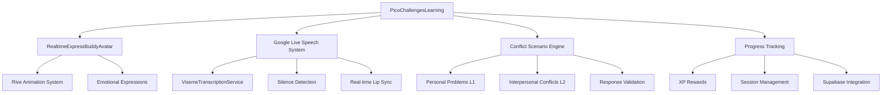

# Design Document

## Overview

Pico's Challenges is a conflict resolution learning system that extends the existing emotion detective infrastructure to teach children social skills through interactive scenarios. The system leverages the existing RealtimeExpressBuddyAvatar, Google Live Speech integration with visemes and silence detection, and session management to create engaging conflict resolution experiences.

The design follows a progressive learning model with two main levels: Personal Problems (Level 1) and Interpersonal Conflicts (Level 2). Children help Pico navigate various conflict scenarios by selecting appropriate responses, learning essential social skills through guided practice.

## Architecture

### System Components



### Data Flow

1. **Session Initialization**: Child starts Pico's Challenges → System loads progress → Determines appropriate level and scenarios
2. **Scenario Presentation**: Pico speaks conflict scenario using Google Live Speech → Avatar shows emotional expressions → System waits for child response using silence detection
3. **Response Processing**: Child selects response → System validates choice → Pico provides feedback with appropriate emotional transitions
4. **Progress Tracking**: XP awarded → Progress saved → Next scenario or level unlock determined

## Components and Interfaces

### Core Components

#### 1. PicoChallengesLearning (Main Container)
```typescript
interface PicoChallengesLearningProps {
  childId: string;
  onComplete: (results: ConflictResolutionResults) => void;
}

interface ConflictResolutionResults {
  sessionId: string;
  totalXP: number;
  scenariosCompleted: number;
  skillsImproved: string[];
  timeSpent: number;
  level: number;
}
```

**Responsibilities:**
- Orchestrates the entire conflict resolution learning flow
- Manages session state and progress tracking
- Integrates with Google Live Speech system
- Handles avatar emotional state management

#### 2. ConflictScenarioEngine
```typescript
interface ConflictScenario {
  id: string;
  type: 'personal' | 'interpersonal';
  level: 1 | 2;
  title: string;
  description: string;
  picoEmotion: 'sad' | 'angry' | 'worried' | 'frustrated' | 'confused';
  picoDialogue: string;
  responseOptions: ConflictResponse[];
  correctResponseId: string;
  skillCategory: 'problem-solving' | 'empathy' | 'communication' | 'sharing';
}

interface ConflictResponse {
  id: string;
  text: string;
  isHelpful: boolean;
  feedback: string;
  picoReaction: 'happy' | 'relieved' | 'grateful' | 'disappointed';
  skillsReinforced: string[];
}
```

**Responsibilities:**
- Generates age-appropriate conflict scenarios
- Manages scenario progression and difficulty
- Validates response choices and provides feedback
- Tracks skill development across categories

#### 3. Google Live Speech Integration
```typescript
interface ConflictSpeechController {
  speakScenario: (scenario: ConflictScenario) => Promise<void>;
  speakFeedback: (feedback: string, emotion: string) => Promise<void>;
  waitForResponse: () => Promise<void>;
  handleSilenceDetection: (callback: () => void) => void;
}
```

**Responsibilities:**
- Manages Pico's speech with natural lip-sync using VisemeTranscriptionService
- Implements silence detection for response timing
- Handles emotional voice modulation based on scenario context
- Provides real-time viseme data to avatar system

#### 4. Avatar Emotional State Manager
```typescript
interface AvatarEmotionalState {
  currentEmotion: string;
  transitionToEmotion: (emotion: string, duration: number) => void;
  expressEmotion: (emotion: string, intensity: number) => void;
  resetToNeutral: () => void;
}
```

**Responsibilities:**
- Manages Pico's emotional expressions during scenarios
- Handles smooth transitions between emotional states
- Synchronizes emotions with speech and scenario context
- Integrates with existing Rive animation system

### Scenario Content Structure

#### Level 1: Personal Problems
```typescript
const PERSONAL_PROBLEM_SCENARIOS: ConflictScenario[] = [
  {
    id: 'dropped_sandwich',
    type: 'personal',
    level: 1,
    title: 'The Dropped Sandwich',
    description: 'Pico accidentally dropped their lunch',
    picoEmotion: 'sad',
    picoDialogue: "Oh no! I dropped my sandwich and now I'm really hungry and sad. What should I do?",
    responseOptions: [
      {
        id: 'ask_help',
        text: "Ask a grown-up for help",
        isHelpful: true,
        feedback: "That's a great idea! Asking for help when we have problems is always smart.",
        picoReaction: 'relieved'
      },
      {
        id: 'cry_loudly',
        text: "Cry really loudly",
        isHelpful: false,
        feedback: "I understand you're sad, but crying loudly might not solve the problem. Let's try something else.",
        picoReaction: 'disappointed'
      }
    ],
    skillCategory: 'problem-solving'
  }
];
```

#### Level 2: Interpersonal Conflicts
```typescript
const INTERPERSONAL_CONFLICT_SCENARIOS: ConflictScenario[] = [
  {
    id: 'toy_sharing',
    type: 'interpersonal',
    level: 2,
    title: 'The Toy Dispute',
    description: 'A friend took Pico\'s toy without asking',
    picoEmotion: 'angry',
    picoDialogue: "My friend took my toy and won't give it back. I'm getting angry. Help me figure out what to say!",
    responseOptions: [
      {
        id: 'polite_request',
        text: "Can I please have my toy back?",
        isHelpful: true,
        feedback: "Perfect! Using polite words like 'please' helps solve problems peacefully.",
        picoReaction: 'happy'
      },
      {
        id: 'grab_toy',
        text: "Just grab the toy back",
        isHelpful: false,
        feedback: "Grabbing might cause more problems. Let's try using our words instead.",
        picoReaction: 'worried'
      }
    ],
    skillCategory: 'communication'
  }
];
```

## Data Models

### Database Schema Extensions

#### Conflict Resolution Progress Table
```sql
CREATE TABLE conflict_resolution_progress (
  id UUID PRIMARY KEY DEFAULT gen_random_uuid(),
  child_id UUID REFERENCES children(id) ON DELETE CASCADE,
  current_level INTEGER DEFAULT 1,
  total_scenarios_completed INTEGER DEFAULT 0,
  personal_problems_mastered INTEGER DEFAULT 0,
  interpersonal_conflicts_mastered INTEGER DEFAULT 0,
  skill_scores JSONB DEFAULT '{"problem-solving": 0, "empathy": 0, "communication": 0, "sharing": 0}',
  total_xp INTEGER DEFAULT 0,
  current_streak INTEGER DEFAULT 0,
  best_streak INTEGER DEFAULT 0,
  unlocked_levels INTEGER[] DEFAULT ARRAY[1],
  created_at TIMESTAMP WITH TIME ZONE DEFAULT NOW(),
  updated_at TIMESTAMP WITH TIME ZONE DEFAULT NOW(),
  UNIQUE(child_id)
);
```

#### Conflict Resolution Sessions Table
```sql
CREATE TABLE conflict_resolution_sessions (
  id UUID PRIMARY KEY DEFAULT gen_random_uuid(),
  child_id UUID REFERENCES children(id) ON DELETE CASCADE,
  level INTEGER NOT NULL,
  scenarios_presented TEXT[] NOT NULL,
  scenarios_completed INTEGER DEFAULT 0,
  correct_responses INTEGER DEFAULT 0,
  skills_practiced TEXT[] DEFAULT ARRAY[]::TEXT[],
  xp_earned INTEGER DEFAULT 0,
  duration_seconds INTEGER,
  completed_at TIMESTAMP WITH TIME ZONE,
  created_at TIMESTAMP WITH TIME ZONE DEFAULT NOW()
);
```

#### Scenario Attempts Table
```sql
CREATE TABLE scenario_attempts (
  id UUID PRIMARY KEY DEFAULT gen_random_uuid(),
  session_id UUID REFERENCES conflict_resolution_sessions(id) ON DELETE CASCADE,
  scenario_id TEXT NOT NULL,
  scenario_type TEXT NOT NULL, -- 'personal' or 'interpersonal'
  response_selected TEXT NOT NULL,
  was_helpful BOOLEAN NOT NULL,
  attempts_count INTEGER DEFAULT 1,
  time_spent_seconds INTEGER DEFAULT 0,
  skills_reinforced TEXT[] DEFAULT ARRAY[]::TEXT[],
  created_at TIMESTAMP WITH TIME ZONE DEFAULT NOW()
);
```

### TypeScript Interfaces

```typescript
// Core conflict resolution types
export interface ConflictResolutionProgress {
  id: string;
  childId: string;
  currentLevel: number;
  totalScenariosCompleted: number;
  personalProblemsMastered: number;
  interpersonalConflictsMastered: number;
  skillScores: {
    'problem-solving': number;
    empathy: number;
    communication: number;
    sharing: number;
  };
  totalXP: number;
  currentStreak: number;
  bestStreak: number;
  unlockedLevels: number[];
  createdAt: Date;
  updatedAt: Date;
}

export interface ConflictResolutionSession {
  id: string;
  childId: string;
  level: number;
  scenariosPresented: string[];
  scenariosCompleted: number;
  correctResponses: number;
  skillsPracticed: string[];
  xpEarned: number;
  durationSeconds?: number;
  completedAt?: Date;
  createdAt: Date;
}

export interface ScenarioAttempt {
  id: string;
  sessionId: string;
  scenarioId: string;
  scenarioType: 'personal' | 'interpersonal';
  responseSelected: string;
  wasHelpful: boolean;
  attemptsCount: number;
  timeSpentSeconds: number;
  skillsReinforced: string[];
  createdAt: Date;
}
```

## Error Handling

### Graceful Degradation Strategy

1. **Avatar Animation Issues**: Continue with text-based scenarios
2. **Database Connection Loss**: Cache progress locally and sync when reconnected
3. **Scenario Loading Errors**: Use fallback scenarios from local storage

### Error Recovery Patterns

```typescript
interface ConflictResolutionErrorHandler {
  handleSpeechError: (error: Error) => void;
  handleAvatarError: (error: Error) => void;
  handleDatabaseError: (error: Error) => void;
  recoverFromError: (errorType: string) => Promise<void>;
}
```

## Testing Strategy

### Unit Testing
- **Scenario Engine**: Test scenario generation, response validation, and progression logic
- **Speech Integration**: Mock Google Live Speech service and test viseme synchronization
- **Progress Tracking**: Test XP calculation, level unlocking, and skill scoring
- **Database Operations**: Test CRUD operations for all conflict resolution tables

### Integration Testing
- **Avatar + Speech**: Test emotional expression synchronization with speech
- **Scenario Flow**: Test complete scenario presentation → response → feedback cycle
- **Progress Persistence**: Test session data saving and loading across app restarts

### User Experience Testing
- **Child Engagement**: Test scenario relevance and age-appropriateness
- **Response Time**: Ensure silence detection works appropriately for child response patterns
- **Emotional Impact**: Verify Pico's emotional transitions feel natural and supportive

### Accessibility Testing
- **Screen Reader**: Test with screen readers for visually impaired children
- **Motor Accessibility**: Ensure response selection works with various input methods
- **Cognitive Load**: Test scenario complexity appropriate for target age groups

## Performance Considerations

### Real-time Speech Processing
- **Viseme Latency**: Target <50ms latency for natural lip-sync
- **Memory Management**: Efficient cleanup of audio buffers and animation frames
- **Battery Optimization**: Minimize continuous processing when not actively speaking

### Database Optimization
- **Query Performance**: Index on child_id, session_id, and created_at fields
- **Data Archiving**: Archive old sessions to maintain performance
- **Caching Strategy**: Cache frequently accessed scenarios and progress data

### Avatar Animation Performance
- **Frame Rate**: Maintain 60fps for smooth emotional transitions
- **Asset Loading**: Preload common emotional expressions
- **Memory Usage**: Efficient Rive animatistate management

## Security and Privacy

### Data Protection
- **Child Data**: All conflict resolution data encrypted at rest
- **Session Privacy**: No audio recording or storage of child responses
- **Progress Isolation**: Row-level security ensures children only access their own data

### Content Safety
- **Scenario Review**: All conflict scenarios reviewed for age-appropriateness
- **Response Validation**: Prevent inappropriate or harmful response suggestions
- **Emotional Safety**: Ensure Pico's reactions are always supportive and non-judgmental