# ExpressBuddy Architecture - Visual Flowcharts (Mermaid Diagrams)

## Complete System Flow Diagram

```mermaid
graph TB
    Start["👤 User Interaction"] -->|Microphone| AudioInput["🎤 Audio Stream<br/>(16kHz PCM16)"]
    AudioInput -->|WebRTC| Gemini["🤖 Gemini Live API<br/>(Multimodal)"]
    
    Gemini -->|"'setup' event"| Setup["📊 Configure<br/>Audio Format"]
    Gemini -->|"'media' event"| AudioBuffer["📦 Buffer Audio<br/>Chunks"]
    Gemini -->|"'content' event"| TextBuffer["📝 Buffer Text<br/>Chunks"]
    
    Gemini -->|Decision| ToolDecision{"Use Tools?"}
    ToolDecision -->|"YES"| ToolCall["🔧 Tool Call Event<br/>(Memory Functions)"]
    ToolDecision -->|"NO"| DirectResponse["Direct Response<br/>Generation"]
    
    ToolCall -->|"Memory Tools"| MemoryExec["💾 Execute:<br/>- write_to_memory<br/>- get_memories_by_keys"]
    MemoryExec -->|"Async (NON_BLOCKING)"| MemoryStore["💾 localStorage<br/>Persistence"]
    MemoryExec -->|"Tool Response"| ToolResponse["📤 Send Tool<br/>Results Back"]
    
    ToolResponse -->|"Streaming"| DirectResponse
    
    AudioBuffer -->|"turncomplete"| AudioProcess["🔄 Process<br/>Complete Audio"]
    TextBuffer -->|"Accumulate"| TextDisplay["🎬 Display<br/>Subtitles"]
    
    AudioProcess -->|"Combine Chunks"| AudioPlay["🔊 Play Audio<br/>via Speaker"]
    AudioPlay -->|"Update State"| AvatarTalk["🎭 Avatar<br/>TALKING State"]
    
    AvatarTalk -->|"Talking Animation"| VideoPlay["▶️ Show Talking<br/>Video MP4"]
    VideoPlay -->|"Chroma Key"| ChromaKey["✨ Remove Green<br/>Screen"]
    ChromaKey -->|"Display"| FinalRender["🖼️ Final<br/>Avatar Output"]
    
    TextDisplay -->|"When Done"| TranscriptSave["📝 Save<br/>Transcripts"]
    TranscriptSave -->|"Supabase"| DBStore["💾 Conversation<br/>Database"]
    
    AudioPlay -->|"End of Audio"| AvatarIdle["🎭 Avatar<br/>IDLE State"]
    AvatarIdle -->|"Loop"| Start
```

## User Journey Timeline

```mermaid
sequenceDiagram
    participant User as 👤 User
    participant Audio as 🎤 Audio
    participant Gemini as 🤖 Gemini
    participant Memory as 💾 Memory
    participant Transcript as 📝 Transcript
    participant Avatar as 🎭 Avatar
    participant Speaker as 🔊 Speaker
    
    User->>Audio: Speaks "Hi Piko!"
    Audio->>Gemini: Send audio stream
    Gemini->>Transcript: Capture user input
    Gemini->>Gemini: Process & decide if tools needed
    Gemini->>Memory: Call write_to_memory (async)
    Memory->>Memory: Store in localStorage
    Gemini->>Gemini: Generate response text
    Gemini->>Gemini: Generate response audio
    Gemini->>Avatar: Start buffering audio
    Avatar->>Avatar: Change to BUFFERING state
    Gemini->>Avatar: Audio & text chunks stream in
    Avatar->>Avatar: Display subtitles (text)
    Gemini->>Avatar: 'turncomplete' event
    Avatar->>Avatar: Process complete audio
    Avatar->>Avatar: Transition to TALKING state
    Avatar->>Speaker: Play audio PCM16
    Speaker->>User: Audio plays to speakers
    Avatar->>Avatar: Show talking animation MP4
    Transcript->>Transcript: Capture AI output
    Speaker->>Speaker: Audio finished
    Avatar->>Avatar: Transition to IDLE state
    User->>Audio: Ready for next input
```

## Memory System Flow

```mermaid
graph LR
    UserInput["User Shares:<br/>My dog is Max"]
    
    UserInput -->|Gemini Analyzes| Decision{"Should<br/>Store?"}
    
    Decision -->|YES| ToolCall["Tool Call:<br/>write_to_memory"]
    Decision -->|NO| SkipMemory["Continue<br/>Without Save"]
    
    ToolCall -->|Function Args| Execute["Execute:<br/>key: pet_name<br/>value: Max - a dog"]
    
    Execute -->|Async| localStorage["localStorage:<br/>expresbuddy_memory_pet_name"]
    
    localStorage -->|Stored| Ready["✓ Available in<br/>Future Sessions"]
    
    Ready -->|Next Session| Retrieve["get_memories_by_keys<br/>(['pet_name'])"]
    
    Retrieve -->|Returns| MemoryData["{ pet_name: 'Max' }"]
    
    MemoryData -->|Into System Prompt| Gemini["Gemini naturally<br/>references: 'How's Max?'"]
    
    Gemini -->|Natural| Response["No announcement:<br/>Just natural chat"]
```

## Avatar State Machine

## Tool Calling Lifecycle

```mermaid
graph TD
    Define["1️⃣ DEFINE TOOLS<br/>(Tool Declarations)"]
    
    Define -->|Include in Config| Config["Send to Gemini<br/>setConfig({tools})"]
    
    Config -->|Tools Available| Waiting["⏳ Waiting for<br/>User Input"]
    
    Waiting -->|User speaks| Process["🔄 Gemini<br/>Processes Input"]
    
    Process -->|Decision| Decision{"Use<br/>Tools?"}
    
    Decision -->|NO| DirectResp["Direct Response<br/>(Skip tools)"]
    Decision -->|YES| PrepTool["2️⃣ PREPARE TOOL CALL<br/>(Gemini Decision)"]
    
    PrepTool -->|functionCalls array| Event["3️⃣ EMIT EVENT<br/>'toolcall' event"]
    
    Event -->|Handler catches| Parse["4️⃣ PARSE<br/>- Extract function name<br/>- Extract arguments"]
    
    Parse -->|For each call| Execute["5️⃣ EXECUTE<br/>Run tool function<br/>(write_to_memory,<br/>get_memories_by_keys)"]
    
    Execute -->|Build responses| BuildResp["6️⃣ BUILD RESPONSE<br/>{<br/>  toolName: name,<br/>  id: call_id,<br/>  response: result<br/>}"]
    
    BuildResp -->|Send back| Send["7️⃣ SEND TO GEMINI<br/>client.send(response)"]
    
    Send -->|Tool result| Gemini["🤖 Gemini<br/>Uses tool result"]
    
    Gemini -->|Continues| DirectResp
    DirectResp -->|Generate| Response["📤 Generate Response<br/>(with tool context)"]
    
    Response -->|Stream| Output["🎬 Output<br/>Audio & Text"]
```

## Audio Processing Pipeline

```mermaid
graph TB
    MicInput["🎤 Microphone<br/>Input"]
    
    MicInput -->|16kHz PCM16| AudioStreamer["📤 AudioStreamer<br/>(Sending)"]
    MicInput -->|Capture STT| TransService["📝 Transcript<br/>Service"]
    
    AudioStreamer -->|Send to API| GeminiAPI["🤖 Gemini<br/>Live API"]
    
    GeminiAPI -->|'setup'| Setup["📊 Audio Setup<br/>Configure format"]
    GeminiAPI -->|'media'| MediaEvents["📦 Media Events<br/>Audio chunks"]
    GeminiAPI -->|'content'| TextEvents["📝 Text Events<br/>Response text"]
    
    MediaEvents -->|Buffer| AudioBuf["🔁 Audio Buffer<br/>Accumulate chunks"]
    
    TextEvents -->|Accumulate| TextBuf["📦 Text Buffer<br/>Streaming text"]
    
    TextBuf -->|Chunks| Display["🎬 Display<br/>Captions"]
    
    AudioBuf -->|Check| Interrupt{"User<br/>Speaking?"}
    
    Interrupt -->|NO| Normal["Continue<br/>Buffering"]
    Interrupt -->|YES| Stop["🛑 Interrupt<br/>AI Audio"]
    
    Stop -->|Clear| ClearBuf["Clear Audio<br/>Buffer"]
    Stop -->|Reset| Reset["Reset State"]
    
    Normal -->|'turncomplete'| Complete["✅ Turn<br/>Complete"]
    
    Complete -->|Process| Combine["Combine all<br/>chunks"]
    
    Combine -->|Single Buffer| Play["🔊 Play Audio<br/>addPCM16()"]
    
    Play -->|Output| Speaker["🔊 Speaker<br/>Output"]
    
    Speaker -->|Finish| Cleanup["🧹 Cleanup<br/>Buffers"]
    
    Cleanup -->|Save| TransService
    
    TransService -->|Supabase| DB["💾 Database"]
```

## Complete Connection State Diagram

## Hint/Help System Flow

```mermaid
graph TB
    KeyDown["⌨️ Key Down<br/>Event"]
    
    KeyDown -->|Check: Space bar?| IsSpace{"Space<br/>Bar?"}
    
    IsSpace -->|NO| IgnoreKey["Ignore"]
    IsSpace -->|YES| Hold["👆 Hold detected<br/>Track duration"]
    
    Hold -->|> 200ms| ShowUI["Display Hint UI<br/>NudgeIndicator"]
    
    ShowUI -->|Show options| Options["Hint Options:<br/>1. I'm stuck<br/>2. Explain<br/>3. Skip<br/>4. Encourage"]
    
    Options -->|User selects| BuildMsg["Build message<br/>based on hint"]
    
    BuildMsg -->|Create text| Message["'[HINT: I'm stuck]'"]
    
    Message -->|Send| SendToGemini["sendHintToGemini(msg)"]
    
    SendToGemini -->|Check status| Status{"Connected &<br/>Ready?"}
    
    Status -->|NO| Error["❌ Error:<br/>Not connected"]
    Status -->|YES| SendMsg["📤 Send to API<br/>client.send(textPart)"]
    
    SendMsg -->|Async| LoStorage["Save hint<br/>to localStorage"]
    
    SendMsg -->|Gemini receives| GeminiProcess["🤖 Gemini<br/>Processes hint"]
    
    GeminiProcess -->|Responds| HelpResponse["Generate help<br/>response"]
    
    HelpResponse -->|Stream| Output["Output to<br/>user"]
```

## Video Rendering Pipeline

## Memory Storage & Retrieval

```mermaid
graph LR
    Write["write_to_memory<br/>{key, value}"]
    Get["get_memories_by_keys<br/>{keys: []}"]
    GetAll["get_available_memory_keys<br/>{}"]
    
    Write -->|Store| LocalStorage["localStorage<br/>expresbuddy_memory_*"]
    
    Get -->|Query| LocalStorage
    GetAll -->|List all keys| LocalStorage
    
    LocalStorage -->|Retrieve| Memory["🧠 Memory Context"]
    
    Memory -->|Inject into| Prompt["System Prompt"]
    
    Prompt -->|Include context| Gemini["🤖 Gemini<br/>Knows: Pet name,<br/>Interests,<br/>Preferences"]
    
    Gemini -->|Natural response| Response["Generate response<br/>with memory context"]
    
    Response -->|Seamless| Conversation["🗣️ Natural<br/>Conversation"]
```

## Error Recovery Paths

```mermaid
graph TD
    Error["⚠️ Error Detected"]
    
    Error -->|Type?| CheckType{"Error<br/>Type?"}
    
    CheckType -->|Connection| ConnError["Connection Lost"]
    CheckType -->|Audio| AudioError["Audio Issue"]
    CheckType -->|Tool| ToolError["Tool Execution"]
    CheckType -->|Video| VideoError["Video Load"]
    CheckType -->|Memory| MemError["Storage Full"]
    
    ConnError -->|Retry| Reconnect["Auto-reconnect<br/>with backoff"]
    Reconnect -->|Success| Restore["Restore session"]
    Reconnect -->|Fail| UserMsg1["Show UI:<br/>Please refresh"]
    
    AudioError -->|Check perms| PermCheck{"Permissions<br/>OK?"}
    PermCheck -->|NO| ReqPerm["Request permission"]
    PermCheck -->|YES| AudioFallback["Disable audio<br/>Text only mode"]
    
    ToolError -->|Log error| LogTool["Log details"]
    LogTool -->|Send to Gemini| ErrResp["Error response"]
    ErrResp -->|Continue| Normal["Normal flow"]
    
    VideoError -->|Try fallback| Fallback["Use plain<br/>background"]
    Fallback -->|Continue| Normal
    
    MemError -->|Continue| InMemory["Keep in<br/>memory (session)"]
    InMemory -->|Show| UserMsg2["Show: Some data<br/>not saved"]
    
    Normal -->|Recovery| OK["✅ Recovered"]
    UserMsg1 --> Manual["Manual retry"]
    UserMsg2 --> OK
```

## System Component Interactions

```mermaid
graph TB
    subgraph React["React Components"]
        Main["MainInterfaceWithAvatar"]
        Avatar["VideoExpressBuddyAvatar"]
        Captions["Captions"]
        Control["ControlTray"]
        Nudge["NudgeIndicator"]
    end
    
    subgraph Context["Context & Hooks"]
        LiveAPICtx["LiveAPIContext"]
        Hook["use-live-api.ts"]
        BufferHook["useResponseBuffer"]
        HintHook["useHintSystem"]
    end
    
    subgraph Services["Services"]
        TranscriptSvc["TranscriptService"]
        GenaiClient["GenAILiveClient"]
    end
    
    subgraph Storage["Storage"]
        LocalStore["localStorage"]
        Supabase["Supabase DB"]
    end
    
    subgraph External["External APIs"]
        Gemini["🤖 Gemini<br/>Live API"]
        WebRTC["🌐 WebRTC<br/>Audio"]
    end
    
    Main -->|Uses| LiveAPICtx
    Avatar -->|Uses| Main
    Captions -->|Uses| Main
    Control -->|Uses| Main
    Nudge -->|Uses| Main
    
    LiveAPICtx -->|Provides| Hook
    Hook -->|Manages| GenaiClient
    Hook -->|Uses| BufferHook
    Hook -->|Uses| HintHook
    
    Main -->|Uses| TranscriptSvc
    TranscriptSvc -->|Logs to| Supabase
    TranscriptSvc -->|Records| LocalStore
    
    HintHook -->|Sends to| GenaiClient
    BufferHook -->|Buffers| Main
    
    GenaiClient -->|Communicates| Gemini
    GenaiClient -->|Streams| WebRTC
    
    Hook -->|Stores memory| LocalStore
    Main -->|Tool calls| LocalStore
```

## Data Flow Summary: Input → Processing → Output

```mermaid
graph LR
    UI["👤 User<br/>Interface"]
    
    UI -->|Audio Input| Input["🎤 INPUT PHASE<br/>- Microphone capture<br/>- 16kHz PCM16<br/>- Transcript record"]
    
    Input -->|Stream| Process["🔄 PROCESS PHASE<br/>- Gemini analyzes<br/>- Tool decision<br/>- Memory functions<br/>- Response generation"]
    
    Process -->|Audio + Text| Buffer["📦 BUFFER PHASE<br/>- Accumulate audio<br/>- Accumulate text<br/>- Detect completion"]
    
    Buffer -->|Combine| Output["📤 OUTPUT PHASE<br/>- Play audio<br/>- Show captions<br/>- Animate avatar<br/>- Save transcript"]
    
    Output -->|Feedback| UI
    
    Output -->|Persist| Persist["💾 PERSIST PHASE<br/>- Save to localStorage<br/>- Save to Supabase<br/>- Memory storage"]
    
    Persist -->|Available| NextSession["↩️ Next Session<br/>Load memories<br/>Build context<br/>Continue naturally"]
```

---

## Performance Metrics Flow

```mermaid
graph TB
    Monitor["📊 Monitoring"]
    
    Monitor -->|Packet Stats| Packets["Packets tracked:<br/>- Total count<br/>- Total bytes<br/>- Dropped packets<br/>- Latency (min/max/avg)"]
    
    Monitor -->|Timing| Timing["Timing metrics:<br/>- Audio processing time<br/>- Buffering duration<br/>- Response latency<br/>- Playback duration"]
    
    Monitor -->|Health| Health["System health:<br/>- Connection status<br/>- Buffer capacity<br/>- Memory usage<br/>- FPS (video)"]
    
    Packets -->|Report| Report["Diagnostic Report<br/>logPerformanceReport()"]
    Timing -->|Report| Report
    Health -->|Report| Report
    
    Report -->|Debug| Debug["🔍 Debugging<br/>Use console logs<br/>Check latency<br/>Identify bottlenecks"]
```

---

This document provides comprehensive Mermaid diagrams showing:
- Complete system flow
- User journey timeline
- Memory system operations
- Avatar state transitions
- Tool calling lifecycle
- Audio processing pipeline
- Connection state management
- Hint/help system flow
- Video rendering pipeline
- Memory storage and retrieval
- Error recovery paths
- Component interactions
- Data flow summary
- Performance monitoring

All diagrams are integrated into the main ARCHITECTURE_DIAGRAM.md for comprehensive documentation.
